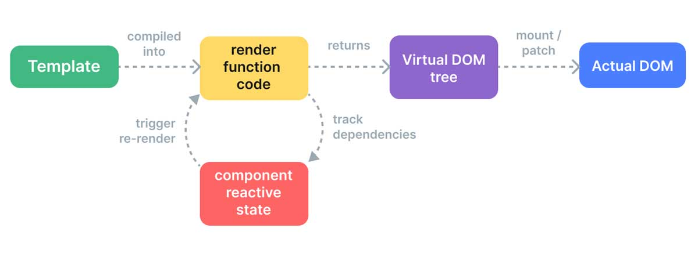
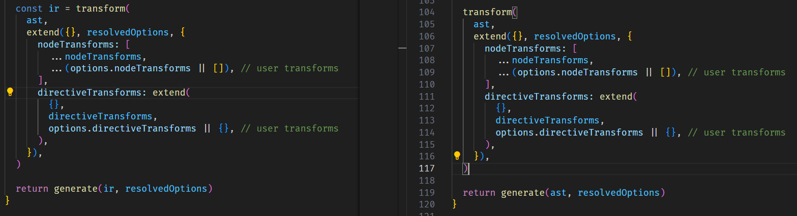
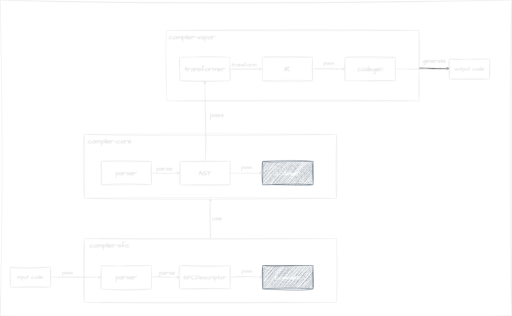
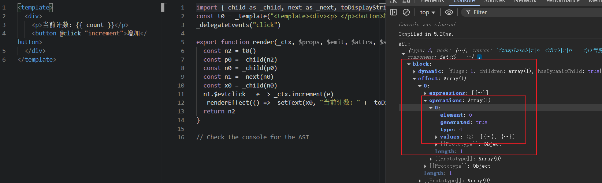

## Vue Vapor Mode 解析

从 vDOM 编译优化到 Vapor Mode 的演进之路

---
transition: fade-out
---

## 目录

<div class="grid grid-cols-2 gap-8 mt-8">
<div>

### **vDOM 编译优化**
- **静态提升**
- **补丁标志** 

</div>
<div>

###  **Vapor Mode** 
- **性能对比**
- **技术细节**

</div>
</div>

---
layout: center
class: text-center
---

## vDOM 编译优化

现代前端框架的性能优化之路

---

## vDOM 简介

vDOM 是一种用于描述真实 DOM 结构的树状数据结构

对于VUE来说，其基于 vDOM 的渲染系统将我们代码段中的代码转换为实际的 DOM 节点。

> **`Template` (模板) -> `AST` (抽象语法树) -> `Render Function` (渲染函数) -> `VNode` (虚拟节点) -> `Patch` (更新真实 DOM)**



---

## vDOM 简介

解决了那些核心问题？

1. **性能与效率提升**：虚拟 DOM 通过内存计算替代频繁的真实 DOM 操作，避免重排重绘，将多次状态变更合并为一次最小化更新，显著提升渲染性能。

2. **开发体验提升**：声明式开发降低了心智负担，提升了代码可维护性。

3. **跨平台能力**：渲染逻辑与具体的渲染环境（如浏览器 DOM）解耦，使得同一套代码逻辑可以被适配到不同平台。

---

## 解决 vDOM 的性能瓶颈

虽然 vDOM 提升了速度和性能，但仍存在优化空间

<div class="grid grid-cols-2 gap-8 mt-8">
<div>

#### 主要问题

- **重复创建 VNode**：当组件状态更新时，即使只有一小部分数据变化，Vue 默认仍会重新生成该组件的完整 VNode 子树。
- **diff 成本问题**：组件越复杂，VNode 树越庞大，Diff 的计算开销就越大。这个过程无论最终有无差异，都必须执行。
- **内存压力**：除了维护一个真实的 DOM 树之外，还需要额外维护一个完整的 VNode 树。对于复杂的应用，这会带来更多的内存占用。

</div>
<div>

#### 可优化的地方

- **生成新的 vnode**：重用旧 vnode
  - 静态提升
  - 静态节点合并
- **diff**：精细化 diff，减少不必要的 diff 操作
  - Patch Flags
  - Block Tree

> 💡 **解决方案**  
> Vue3 引入了 "[Compiler-Informed Virtual DOM](https://vuejs.org/guide/extras/rendering-mechanism.html#compiler-informed-virtual-dom)"

</div>
</div>

---
layout: center
---

## 静态提升 (Static Hoisting)

把静态的部分"提升"到 render 函数之外，避免每次渲染都重新创建

<div class="grid grid-cols-2 gap-8 mt-8">
<div>

#### 📝 示例代码

```vue
<div>
  <div>foo</div> <!-- cached -->
  <div>bar</div> <!-- cached -->
  <div>{{ dynamic }}</div>
</div>
```

</div>
<div>

#### ⚡ 编译后的结果

```javascript
export function render(_ctx, _cache, $props, $setup, $data, $options) {
  return (_openBlock(), _createElementBlock("div", null, [
    _cache[0] || (_cache[0] = _createElementVNode("div", null, "foo", -1 /* CACHED */)),
    _createCommentVNode(" cached "),
    _cache[1] || (_cache[1] = _createElementVNode("div", null, "bar", -1 /* CACHED */)),
    _createCommentVNode(" cached "),
    _createElementVNode("div", null, _toDisplayString(_ctx.dynamic), 1 /* TEXT */)
  ]))
}

```

</div>
</div>

---

## 静态节点合并优化

当有足够多的连续静态元素时，它们会被合并成一个静态 VNode

<div class="grid grid-cols-2 gap-4">
<div>

#### 原始模板

```vue
<div>
  <div class="foo">foo</div>
  <div class="foo">foo</div>
  <div class="foo">foo</div>
  <div class="foo">foo</div>
  <div class="foo">foo</div>
  <div>{{ dynamic }}</div>
</div>
```

</div>
<div>

#### 编译后

```js
export function render(_ctx, _cache, $props, $setup, $data, $options) {
  return (_openBlock(), _createElementBlock("div", null, [
    _cache[0] || (_cache[0] = _createStaticVNode("<div class=\"foo\">foo</div><div class=\"foo\">foo</div><div class=\"foo\">foo</div><div class=\"foo\">foo</div><div class=\"foo\">foo</div>", 5)),
    _createElementVNode("div", null, _toDisplayString(_ctx.dynamic), 1 /* TEXT */)
  ]))
}
```

</div>
</div>

---

## 静态提升的优势与局限

<div class="grid grid-cols-2 gap-8">
<div>

#### ✅ 优势

- **减少内存占用**
  - 静态节点只创建一次
  - 避免重复创建的内存占用

- **提高渲染速度**
  - 避免重复创建和销毁节点的开销，提升渲染速度

- **减少垃圾回收压力**
  - 减少需要垃圾回收的对象数量

</div>
<div>

#### ⚠️ 局限性

- **动态属性限制**
  - 包含动态属性的节点不能被静态提升

- **适用场景有限**
  - 只对静态内容有效

</div>
</div>

---
layout: center
class: text-center
---

## Patch Flags

精细化的动态节点更新策略

---

## Patch Flags 详解

`Patch Flags` 是一个数字标识，告诉运行时这个节点的哪些部分可能会发生变化。

<div class="mt-8">

| 补丁标志 | 值 | 含义 | 示例 |
|---------|----|------|------|
| `TEXT` | 1 | 文本节点的内容需要更新 | `<div>{{ dynamic }}</div>` |
| `CLASS` | 1 << 1 | 节点的 class 属性需要更新 | `<div :class="{ active }"></div>` |
| `STYLE` | 1 << 2 | 节点的 style 属性需要更新 | `<div :style="styleObj"></div>` |
| `PROPS` | 1 << 3 | 节点的属性需要更新 | `<input :value="value">` |
| `FULL_PROPS` | 1 << 4 | 节点的属性和事件需要更新 | `<div :id="id" @click="handleClick"></div>` 
</div>

<div class="mt-6 text-sm text-gray-600">
💡 详见: <a href="https://github.com/vuejs/core/blob/main/packages/shared/src/patchFlags.ts" target="_blank">Vue Core PatchFlags</a>
</div>

---

## Patch Flags 工作原理

在createVnode的时候，会把patchFlags相关的参数都放到vnode对象里面：

<div class="grid grid-cols-2 gap-4">
<div>

#### 模板代码

```vue
<!-- class -->
<div :class="{ active }"></div>

<!-- props -->
<input :id="id" :value="value" :placeholder="placeholder">

<!-- Text -->
<div>{{ dynamic }}</div>
```

</div>
<div>

#### 编译后的代码

```js
export function render(_ctx) {
  return createElementBlock(Fragment, null, [
    // CLASS 标志 (2)
    createElementVNode("div", {
      class: normalizeClass({ active: _ctx.active })
    }, null, 2 /* CLASS */), 
    
    // PROPS 标志 (8)
    createElementVNode("input", {
      id: _ctx.id,
      value: _ctx.value,
      placeholder: _ctx.placeholder
    }, null, 8 /* PROPS */, ["id", "value", "placeholder"]),
    
    // TEXT 标志 (1)
    createElementVNode("div", null, 
      toDisplayString(_ctx.dynamic), 1 /* TEXT */)
  ])
}
```

</div>
</div>

---
---

## Patch Flags 工作原理

当节点有patchFlag的时候，会根据patchFlag来判断哪些属性需要更新，从而做到精确更新，减少不必要的 patch 操作。

```javascript
// 传统方式：需要比较所有属性
if (oldVNode.props !== newVNode.props) {
  // 比较所有属性
  for (const key in newVNode.props) {
    // 逐一比较每个属性
  }
}
// Patch Flag 方式：只比较标记的属性
if (patchFlag & PatchFlags.CLASS) {
  // 只更新 class
  patchClass(el, oldVNode.props.class, newVNode.props.class)
}
if (patchFlag & PatchFlags.STYLE) {
  // 只更新 style
  patchStyle(el, oldVNode.props.style, newVNode.props.style)
}
// 静态节点（patchFlag = -1）直接跳过
if (patchFlag === PatchFlags.HOISTED) {
  return // 跳过更新
}
```

---
layout: center
class: text-center
---

# 完美了吗？

## 依旧存在问题...


---

## vDOM 不可避免的问题

即使有了静态提升和补丁标志，vDOM 仍然存在不可避免的问题

<div class="grid grid-cols-3 gap-4">
<div>

#### 🧠 内存开销

- 维护真实 DOM 树
- **额外维护完整的 VNode 树**
- 复杂应用带来巨大内存占用

</div>
<div>

#### ⚡ 运行时开销

- 新旧 VNode 树的比对过程
- **Diff 算法的递归遍历**
- 组件越复杂，计算开销越大

</div>
<div>

#### 📦 JavaScript 负载

- 虚拟 DOM、Diff 算法、Patch 逻辑
- **增加框架体积**
- 影响页面可交互时间 (TTI)

</div>
</div>

---
layout: center
class: text-center
---

#### 是否存在一种架构，能够继承声明式编程的优势，同时绕过虚拟 DOM 的运行时开销，在编译时就知道什么变了，从而实现更为直接、更为精准的 UI 更新？

---
layout: center
class: text-center
---

# Vapor Mode

#### 全新的渲染机制

无虚拟DOM  提升性能  减少包体积

基于 @vue/reactivity 实现响应式


---

# Vapor Mode 核心思想

从"运行时比对"到"编译时分析"

<div class="mt-8">

#### 🤔 核心问题

> 如果我们在**编译时**就已经能精确地知道模板中哪些部分是永不改变的（静态），哪些部分是可能改变的（动态），以及动态部分与哪个数据源绑定，那我们是否还需要完整的 VNode 和运行时的 Diff 过程呢？

</div>

<div class="grid grid-cols-2 gap-8 mt-8">
<div>

#### 🔍 编译时分析

1. **静态分析**：遍历模板，识别动态绑定
2. **生成指令式代码**：为每个动态绑定生成直接的 DOM 操作
3. **响应式副作用**：将 DOM 操作包裹在 `effect` 中

</div>
<div>

#### 🎯 最终结果

- 不再创建 VNode 的渲染函数
- 直接的、命令式的 DOM 操作代码
- 类似原生 JavaScript 的性能

</div>
</div>

---

# Vapor Mode 原理

Vue Vapor 基于 @vue/reactivity 响应式系统，通过追踪数据变化来更新DOM
````md magic-move
```typescript {all|1-9|10-13|15-19|all}
let count = 0;
const root = document.getElementById('app');

const el = document.createElement('div');
root.appendChild(el);
const btn = document.createElement('button');
root.appendChild(btn);
btn.innerHTML = '点我';

btn.addEventListener('click',()=>{
  count++;
  render();
})

function render() {
  el.innerHTML = count;
}
render();
```
```typescript {all|4-9|10-14|15-20|all}
const { createApp, ref, effect } = Vue
const count = ref(0);
const root = document.getElementById('app');
// 1. 创建并插入静态模板
const el = document.createElement('div');
root.appendChild(el);
const btn = document.createElement('button');
btn.innerHTML = '点我';
root.appendChild(btn);

// 2. 绑定事件
btn.addEventListener('click', () => {
  count.value++;
})

// 3. 将响应式数据源与DOM操作直接绑定
effect(() => {
  // 当 count.value 变化时，仅更新 el 的内容
  el.innerHTML = count.value;
})
```
````
> 💡 **关键**：消除了 VNode 创建和运行时 Diff 的开销
---

## Vapor Mode vs vDOM 对比

#### 📝 计数器组件示例

```vue
<script setup lang="ts">
import { ref } from 'vue';
const count = ref(0);
function increment() {
  count.value++;
}
</script>

<template>
  <div>
    <p>当前计数: {{ count }}</p>
    <button @click="increment">增加</button>
  </div>
</template>
```

---

## Vapor 编译结果

```js
const t0 = _template("<div><p> </p><button>增加</button></div>", true);
function _sfc_render(_ctx, $props, $emit, $attrs, $slots) {
  // 拿到模板
  const n2 = t0();
  // 拿到模板的第一个子节点，<p/>
  const n0 = _child(n2);
  // 拿到 n0 的兄弟节点，<button />
  const n1 = _next(n0);
  // 拿到 n0 的子节点，#text
  const x0 = _child(n0);
  // 设置 button 的事件
  n1.$evtclick = _ctx.increment;
  // 将设置文本操作放到响应式函数中，实现精准更新
  _renderEffect(() => 
    _setText(x0, "当前计数: " + _toDisplayString(_ctx.count))
  );
  return n2;
}
```

> ✅ **优势**：

> 1. 直接操作 DOM，精准更新，无需 vDOM，无需 diff

> 2. render 函数只需执行一次
---

## vDOM 编译结果

传统的虚拟 DOM 渲染函数

```js
function _sfc_render(_ctx, _cache, $props, $setup, $data, $options) {
  return _openBlock(), _createElementBlock("div", null, [
    _createElementVNode(
      "p",
      null,
      "当前计数: " + _toDisplayString($setup.count),
      1 /* TEXT */
    ),
    _createElementVNode("button", { 
      onClick: $setup.increment 
    }, "增加")
  ]);
}
```

> ⚠️ **问题**：每次更新都需要创建新的 VNode 并进行 diff 比较
---

# 传统 Vue 3 的更新开销

当 `count` 变化时的处理流程

```js
// 伪代码：当 count 变化时的传统处理流程
count.value++  // 触发响应式更新

// 1. 整个组件的 render 函数重新执行
const newVTree = h('div', [
  h('p', '当前计数: ' + count.value),   // 这个需要更新
  h('button', '增加')
])

// 2. diff 算法比较新旧虚拟 DOM
const patches = diff(oldVTree, newVTree)

// 3. 应用补丁到真实 DOM
applyPatches(realDOM, patches)
```

> ⚠️ **问题**：diff 算法需要遍历和比较大量不相关的节点
---

## 如何实现无虚拟 dom 还能去精准操控 dom？



<div class="grid grid-cols-2 gap-8">
<div class="text-center">
<a href="https://github.com/vuejs/core/blob/56a7f9dd181b9781ec2c684cad49fecd35d14178/packages/compiler-vapor/src/compile.ts#L52">
vapor
</a>
</div>
<div class="text-center">
<a href="https://github.com/vuejs/core/blob/56a7f9dd181b9781ec2c684cad49fecd35d14178/packages/compiler-core/src/compile.ts#L104">
vDOM
</a>
</div>
</div>
---

## 如何实现无虚拟 dom 还能去精准操控 dom？



---
layout: center
class: text-center
---
## 如何实现无虚拟 dom 还能去精准操控 dom？


Template → AST（语法树） 

↓

✨ IR （中间表示）

↓

Runtime Code（mount/update 逻辑）

---

## IR (Intermediate Representation) 是个啥？


<div class="grid grid-cols-2 gap-8 mt-4">
<div>
```typescript
export interface SetTextIRNode extends BaseIRNode {
  type: IRNodeTypes.SET_TEXT
  element: number
  values: SimpleExpressionNode[]
}
```

[SetTextIRNode](https://github.com/vuejs/vue-vapor/blob/30583b9ee1c696d3cb836f0bfd969793e57e849d/packages/compiler-vapor/src/ir/index.ts#L108-L112)
</div>
<div>
```typescript
export enum IRNodeTypes {
  ROOT,
  BLOCK,
  SET_PROP,
  SET_DYNAMIC_PROPS,
  SET_TEXT,
  ...
}
```

[SetTextIRNode](https://github.com/vuejs/vue-vapor/blob/30583b9ee1c696d3cb836f0bfd969793e57e849d/packages/compiler-vapor/src/ir/index.ts#L108-L112)
</div>
</div>
---

## IR 是个啥？


> 传统的 Vue 编译流程：Template → AST → 直接生成渲染函数

> Vapor Mode：Template → AST → IR → 生成块函数（Block Function）

---

## UI = fn(State)

<div text-left="" flex="" flex-wrap="" gap8="" items-center="" justify-center="" class="mt-12">
  <div flex="" flex-col="" gap3="" p4="" w-85="" rounded-xl="" bg="#58c4dc/30" class=""
    data-slidev-clicks-start="1">
    <span flex="" gap2="" items-center="" text-2xl="" font-semibold="" self-center="">
      <div i-logos:react=""></div> React
    </span>
    <span font-mono="" text-sm="">while (stateChanged) <br>&nbsp;&nbsp;UI snapshot = fn(data snapshot)</span>
  </div>
  <div flex="" flex-col="" gap3="" p4="" w-85="" rounded-xl="" bg="green/30" class=""
    >
    <span flex="" gap2="" items-center="" text-2xl="" font-semibold="" self-center="">
      <div i-logos:vue=""></div> Vue vDOM
    </span>
    <span font-mono="" text-sm="">while (stateChanged) <br>&nbsp;&nbsp;UI snapshot = fn(state)</span>
  </div>
  <div flex="" flex-col="" gap3="" items-center="" justify-center="" p4="" w-85="" h-30="" rounded-xl=""
    bg="sky-600/50" data-slidev-clicks-start="3">
    <span flex="" gap2="" items-center="" text-3xl="" font-semibold="">Vue Vapor</span>
    <span font-mono="">UI = fn(state)</span>
  </div>
</div>

---

## 对比

| 维度          | Vapor Mode                          | 传统 VDOM 模式                     |  
|---------------|-------------------------------------|------------------------------------|  
| 中间产物      | AST → IR（更贴近 DOM 操作的指令集）  | AST → 生成渲染函数              | 
| 初始化       | 直接创建 DOM，建立响应式绑定         | 创建 VNode → 生成 DOM
| 运行时        | 直接操作真实 DOM，跳过虚拟 DOM       | 依赖虚拟 DOM 的 Diff/Patch 流程     |  
| 性能特点      | 极致精简，少了虚拟 DOM 对比开销      | 通用性强，但多一层 Diff 开销        |  
| 内存开销      | 只有 DOM 树           | VNode 树 + DOM 树   |  

<div class="grid grid-cols-3 gap-4 mt-6">

**🚀 极致性能**  
消除 VNode 和 Diff 开销

**💾 更低内存**  
无需维护 VNode 树

**📦 更小体积**  
编译器完成大部分工作

</div>

---

# Vapor Mode 的优势总结

<div class="grid grid-cols-2 gap-8 mt-8 mb-12">
<div>

#### 🚀 性能优势

- **极致性能**：消除 VNode 创建和运行时 Diff 开销
- **精准更新**：更新性能与动态绑定数量相关
- **内存友好**：无需在内存中维护 VNode 树
- **启动更快**：更小的框架体积，更快的加载时间

</div>
<div>

#### 🎯 技术创新

- **编译时分析**：在编译阶段识别静态和动态部分
- **直接 DOM 操作**：生成命令式的 DOM 操作代码
- **精确响应式绑定**：数据与 DOM 节点直接映射

</div>
</div>


> 🌟 **Vapor Mode 代表了前端框架的未来方向**  
> 从运行时优化转向编译时优化，实现了性能和开发体验的完美平衡

---
layout: center
class: text-center
---

# 谢谢观看！

## Vue Vapor Mode 深度解析

<div class="pt-12">
  <span class="text-6xl">🎉</span>
</div>

<div class="pt-8">
  <p class="text-lg opacity-75">探索前端框架的未来</p>
</div>

